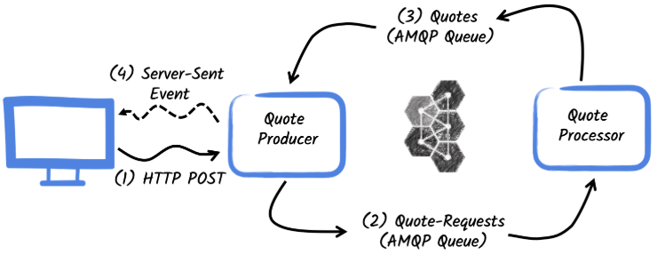

Camel Quarkus AMQP 1.0 Demo
============================

This project demonstrates how to interact with AMQP 1.0 using [Red Hat AMQ Broker 7.13.x](https://docs.redhat.com/en/documentation/red_hat_amq_broker/7.13) and [Red Hat build of Apache Camel 4.14.x for Quarkus](https://docs.redhat.com/en/documentation/red_hat_build_of_apache_camel/4.14#Red%20Hat%20build%20of%20Apache%20Camel%20for%20Quarkus).
It builds on the [Quarkus AMQP quickstart](https://quarkus.io/guides/amqp), with both the quote producer and processor reimplemented using Camel for Quarkus.




## Prerequisites

- JDK 21 installed with `JAVA_HOME` configured appropriately
- Apache Maven 3.9+
- Docker or [Podman](https://podman-desktop.io/)

## Start the application in dev mode

> NOTE: When the `quarkus-messaging-amqp` extension is present and no AMQP broker is explicitly configured, Quarkus automatically enables AMQP Dev Service. This starts a temporary Apache ActiveMQ Artemis broker in development and test modes, streamlining setup and reducing manual configuration.

In a first terminal, run:

```bash
././mvnww -f quotes-producer quarkus:dev -Dquarkus.camel.jolokia.enabled=false
```

In a second terminal, run:

```bash
././mvnww -f quotes-processor quarkus:dev -Dquarkus.http.port=8081 -Dquarkus.camel.jolokia.enabled=false
```  

Then, open your browser to [`http://localhost:8080/quotes.html`](http://localhost:8080/quotes.html), and click on the `Request Quote` button.

## Deploy to OpenShift

### Prerequisite

- [Red Hat AMQ Broker v7.13+](https://docs.redhat.com/en/documentation/red_hat_amq_broker/7.13) operator is deployed in OpenShift

### Instructions

1. Login to the OpenShift cluster:
    ```bash
    oc login ...
    ```
2. Switch to the target OpenShift project:
    ```bash
    oc project ...
    ```
3. Deploy the Red Hat AMQ Broker v7.12+ instance:
    ```bash
    oc apply -f openshift/amq-broker.yaml
    ```
4. Deploy the `quotes-producer`:
    ```bash
    ./mvnw -f quotes-producer package -Dquarkus.openshift.deploy=true
    ```
5. Deploy the `quotes-processor`:
    ```bash
    ./mvnw -f quotes-processor package -Dquarkus.openshift.deploy=true
    ```
6. Run the following command to get the frontend URL for the Quotes app:
    ```bash
    echo "https://`(oc get route quotes-producer -o jsonpath='{.spec.host}')`/quotes.html"
    ```