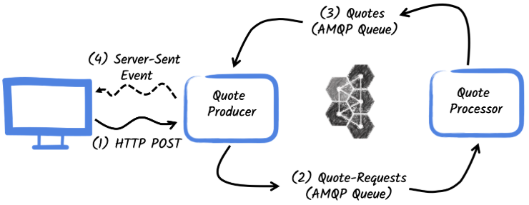

Camel Quarkus AMQP 1.0 Demo
============================

This project demonstrates how to interact with AMQP 1.0 using [Red Hat AMQ Broker 7.14.x](https://docs.redhat.com/en/documentation/red_hat_amq_broker/7.14) and [Red Hat build of Apache Camel 4.14.x for Quarkus](https://docs.redhat.com/en/documentation/red_hat_build_of_apache_camel/4.14#Red%20Hat%20build%20of%20Apache%20Camel%20for%20Quarkus).
It builds on the [Quarkus AMQP quickstart](https://quarkus.io/guides/amqp), with both the quote producer and processor reimplemented using Camel for Quarkus.




## Prerequisites

- JDK 21 installed with `JAVA_HOME` configured appropriately
- Apache Maven 3.9+
- Docker or [Podman](https://podman-desktop.io/)

## Start the application in dev mode

> **NOTE**: In development and test modes, Quarkus automatically starts the following Dev Services:
> - **AMQP Dev Service**: a temporary Apache ActiveMQ Artemis broker (enabled by the `quarkus-messaging-amqp` extension when no AMQP broker is explicitly configured).
> - **Grafana LGTM Dev Service**: a Grafana LGTM stack (Loki, Grafana, Tempo, Mimir) for observability (enabled by the `quarkus-observability-devservices-lgtm` extension). The Grafana endpoint is dynamically assigned; find it via the Quarkus Dev UI at `http://localhost:8080/q/dev-ui`.

In a first terminal, run:

```bash
./mvnw -f quotes-producer quarkus:dev -Dquarkus.camel.jolokia.enabled=false
```

In a second terminal, run:

```bash
./mvnw -f quotes-processor quarkus:dev -Dquarkus.http.port=8081 -Dquarkus.management.port=9877 -Dquarkus.camel.jolokia.enabled=false
```  

Then, open your browser to [`http://localhost:8080/quotes.html`](http://localhost:8080/quotes.html), and click on the `Request Quote` button.

## Deploy to OpenShift

### Instructions

1. Login to the OpenShift cluster:
    ```bash
    oc login ...
    ```
2. Switch to the target OpenShift project:
    ```bash
    oc project ...
    ```
3. Install the [Red Hat AMQ Broker v7.14+](https://docs.redhat.com/en/documentation/red_hat_amq_broker/7.14) operator (skip if already installed):
    ```bash
    oc apply -f openshift/amq-broker-operator.yaml
    # Wait for the operator CSV to reach 'Succeeded'
    oc get csv -w
    ```
4. Deploy the Red Hat AMQ Broker v7.14+ instance:
    ```bash
    oc apply -f openshift/amq-broker.yaml
    ```
> **NOTE**: Before deploying, review the `quarkus.otel.exporter.otlp.endpoint` value in [`quotes-producer/src/main/kubernetes/openshift.yml`](./quotes-producer/src/main/kubernetes/openshift.yml) and [`quotes-processor/src/main/kubernetes/openshift.yml`](./quotes-processor/src/main/kubernetes/openshift.yml). The default (`http://otel-collector.observability.svc:4317`) must be adjusted to match the OpenTelemetry collector endpoint available in your target environment.

5. Deploy the `quotes-producer`:
    ```bash
    ./mvnw -f quotes-producer package -Dquarkus.openshift.deploy=true
    ```
6. Deploy the `quotes-processor`:
    ```bash
    ./mvnw -f quotes-processor package -Dquarkus.openshift.deploy=true
    ```
7. Run the following command to get the frontend URL for the Quotes app:
    ```bash
    echo "https://`(oc get route quotes-producer -o jsonpath='{.spec.host}')`/quotes.html"
    ```